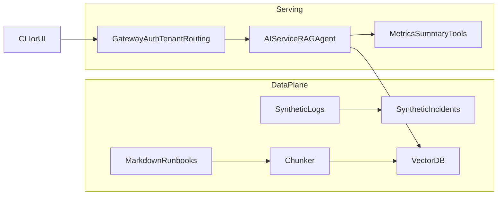

# OpsPilot (intelliOps)

OpsPilot is an **infra-focused incident + FinOps copilot**. This repo is being built in **4 layers** (from a simple demo to an infra-grade LLM gateway) so it reads like a real “platform/infra team” project.

## Repo layout

- `level_zero/`: **Layer 0** single-tenant demo dataset + runbooks + a deterministic CLI (no LLM yet).
- `multi-tenant/`: **Layer 1** multi-tenant demo dataset + runbooks (tenant partitioning scaffold).
- `docs/`: architecture + roadmap (added as part of the baseline OSS structure).

## Layer 0 quickstart (single-tenant demo)

Prereqs: `python3`

Regenerate the Layer 0 dataset (deterministic):

```bash
python3 level_zero/scripts/generate_level_zero.py --seed 42 --hours 24 --out-dir level_zero/data
```

Ask a question using the deterministic CLI (time-window queries like “between 10–11am”):

```bash
python3 level_zero/demo-cli-script/qa_cli.py \
  --question "What happened to checkout-api between 10-11am?"
```

The CLI prints:
- matching incidents in the time window
- referenced runbooks (`level_zero/knowledge_base/runbooks/ERR_...*.md`)
- a symptoms summary (p95 latency, error rate, status counts, etc.)

## Layer 1 quickstart (multi-tenant demo data)

The multi-tenant datasets live under `multi-tenant/data/` and are keyed by `tenant_id` (e.g. `tenant-alpha`, `tenant-beta`, `tenant-gamma`).

Regenerate:

```bash
python3 multi-tenant/scripts/generate.py --seed 42 --count 500 --incidents 8 --out-dir multi-tenant/data
```

## Architecture (target)



Notes:
- Layer 0 starts from **JSON datasets + Markdown runbooks** and builds up to a RAG copilot.
- Layer 1 adds **multi-tenant routing + agent traces + observability**.

## Roadmap

See `docs/roadmap.md`.

## Contributing

See `CONTRIBUTING.md` (branch naming + PR title conventions are enforced on PRs).

## License

Apache-2.0. See `LICENSE`.


