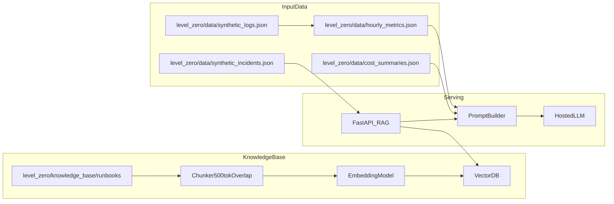
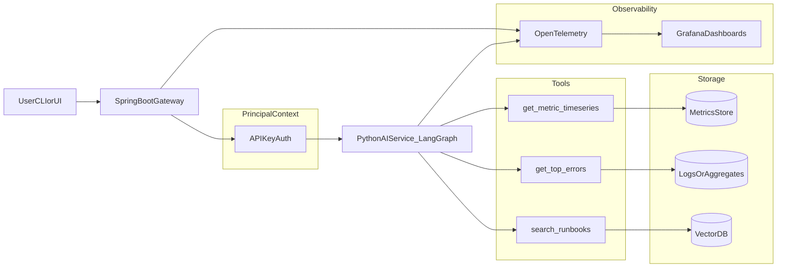

# OpsPilot architecture

_Last updated: 2026-01-09 16:10 IST_

This doc describes the **intended system architecture** for OpsPilot across the roadmap layers.

## Layer 0 — tenant-aware RAG copilot (start with 1 tenant)

Layer 0 focuses on a simple path from incident-shaped data + runbooks → RAG answers with citations.

### Data contracts (baseline)

- **Logs**: `service_name`, `status_code`, `latency_ms`, `env`, `timestamp` (plus optional fields like `error_code`)
- **Incidents**: include `error_codes[]` and `runbook_refs[]` so retrieval can be grounded
- **Runbooks**: Markdown files named `<ERROR_CODE>-<slug>.md`, where `<ERROR_CODE>` is unique

## Layer 1 — gateway + agentic diagnosis + tracing (target)

Layer 1 introduces a **gateway**, a **tool-using agent**, and **end-to-end tracing**.

Note:
- In the first ~30 days, this is **tenant-aware**, but you can run it with **one tenant** (API key auth maps to `tenant_id`; audit/budgets are tagged).
- Customer‑grade **multi‑tenant isolation** is a post‑30 extension (hard boundary everywhere + leak tests + stronger DB isolation).

### Multi-tenant partitioning guidelines

- **Metrics**: partition by `tenant_id` (table partitioning, schema per tenant, or tenant_id column + indexes)
- **Vector DB**: use namespaces or metadata filters on every query (`tenant_id`) to prevent cross-tenant leakage
- **Observability**: always tag traces/metrics/logs with `tenant_id` and model name
