# AI Engineering Learning Index

_Last updated: 2026-05-20 IST_

This is the human starting point for learning AI engineering through IntelliOps/OpsPilot.

## Who this is for

This path is for a Senior Data & Platform Engineer with strong distributed systems, data platform, cost, reliability, and backend experience who wants to move into AI application engineering, AI data engineering, and AI platform engineering.

## Target outcome

After following this system, you should be able to build and defend a production-shaped LLM platform:

- answers grounded in retrieved evidence;
- schema-valid outputs;
- evals as release gates;
- observable latency, quality, and cost;
- governed tools through safe boundaries;
- tenant-aware data access;
- Staff-level design trade-offs.

## Start here

1. Read this file to understand the system.
2. Use [Learning Book](learning-book.md) for today's learning/build task.
3. Use [Learning Fundamentals](learning-fundamentals.md) when a concept is unclear.
4. Use [Practice](practice.md) for labs and artifacts.
5. Use [Interview Bank](interview-bank.md) to practice explanation.
6. Use [Resources](resources.md) only when the guide points you there.

## Document map

| If you need... | Open... |
|---|---|
| What to learn and in what order | [Learning Book](learning-book.md) |
| What to build and how it is judged | [Roadmap](roadmap.md) |
| First-principles theory | [Learning Fundamentals](learning-fundamentals.md) |
| Labs and proof artifacts | [Practice](practice.md) |
| Curated external resources | [Resources](resources.md) |
| Staff interview drills | [Interview Bank](interview-bank.md) |
| Architecture decisions | [ADRs](decisions/) |
| Copy/paste help when stuck | [Hints](hints/) |
| Context for coding agents | [LLM Context](llm-context.md) |

## Skill tree

```mermaid
flowchart TD
  A[Staff Data and Platform Engineer] --> B[AI Application Engineering]
  A --> C[AI Data Engineering]
  A --> D[AI Platform Engineering]
  A --> E[AI Infrastructure Depth]

  B --> B1[LLM APIs and structured outputs]
  B --> B2[RAG and citations]
  B --> B3[Tools and agent workflows]
  B --> B4[Evals and regressions]

  C --> C1[Unstructured ingestion]
  C --> C2[Chunking and embeddings]
  C --> C3[Lineage and freshness]
  C --> C4[Feedback and eval datasets]

  D --> D1[Gateway and tenancy]
  D --> D2[Budgets and routing]
  D --> D3[Observability and audit]
  D --> D4[MCP and tool governance]

  E --> E1[Serving and latency]
  E --> E2[Caching and batching]
  E --> E3[Fine-tuning economics]
  E --> E4[Capacity planning]
```

## 30/60/90-day path

| Window | Focus | Outcome |
|---|---|---|
| Days 1-30 | Layer 0/1 production-shaped RAG | Working copilot with citations, evals, traces, budgets, and one optimization proof. |
| Days 31-60 | AI platform depth | Serving benchmarks, stronger tool governance, multi-tenant hardening, ingestion/eval maturity. |
| Days 61-90 | Staff narrative and polish | Repeatable demo, stronger proof pack, interview drills, resume/story artifacts. |

## Daily loop

Use this loop every day:

1. **Learn for 45 minutes:** read assigned fundamentals and answer core questions.
2. **Build for 45 minutes:** complete the daily build/practice step.
3. **Save one artifact:** trace, eval report, benchmark table, ADR, screenshot, or short note.
4. **Explain in five lines:** write what changed, why it matters, trade-off, failure mode, and next question.

## Learning rule

Do not chase random videos or links when confused. First check the assigned fundamentals section, then the practice lab, then the curated resources.
