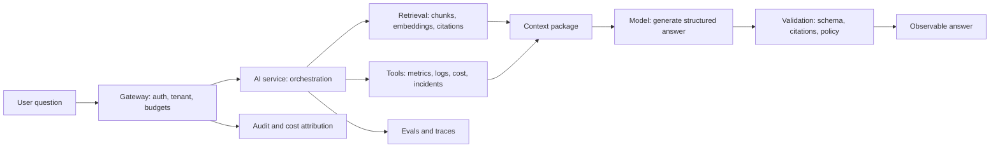
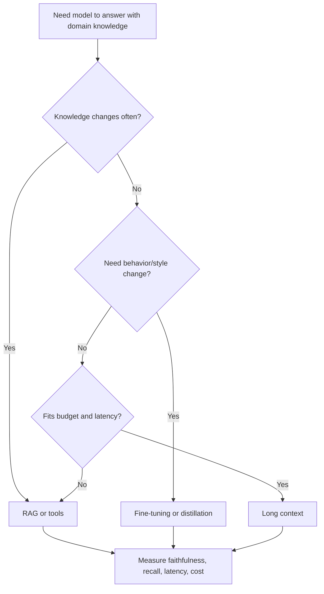
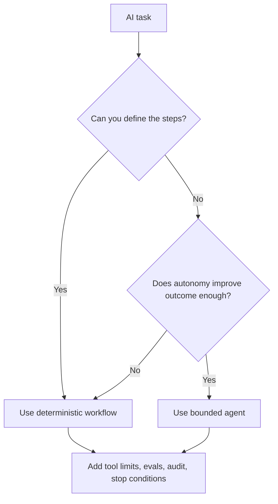

# AI Engineering Learning System Implementation Plan

> **For agentic workers:** REQUIRED SUB-SKILL: Use superpowers:subagent-driven-development (recommended) or superpowers:executing-plans to implement this plan task-by-task. Steps use checkbox (`- [ ]`) syntax for tracking.

**Goal:** Turn the IntelliOps docs into a clear first-principles AI engineering learning system for a Staff Data/Platform Engineer moving into AI application, AI data, and AI platform engineering.

**Architecture:** Use Diátaxis separation so each document has one job: `learning-index.md` is the human front door, `roadmap.md` remains the build spec, `learning-book.md` remains the daily guide, `learning-fundamentals.md` remains the textbook, and new support docs own practice/resources/interview drills. Preserve the 90-minute daily loop while adding first-principles explanations, diagrams, curated resources, and practice artifacts.

**Tech Stack:** Markdown, Obsidian-compatible links, Mermaid diagrams, existing repo docs under `docs/`.

---

## Source spec

Use this approved design as the source of truth:

- `docs/superpowers/specs/2026-05-20-ai-engineering-learning-system-design.md`

## File structure

| File | Responsibility |
|---|---|
| `docs/learning-index.md` | Human front door: profile fit, target outcome, skill tree, 30/60/90-day path, and doc map. |
| `docs/llm-context.md` | Agent handoff only: concise context for future LLM/coding-agent sessions. |
| `docs/roadmap.md` | Canonical build spec and pass/fail gates. |
| `docs/learning-book.md` | Day-by-day curriculum with 90-minute learning/build loop. |
| `docs/learning-fundamentals.md` | First-principles textbook and theory source. |
| `docs/practice.md` | Canonical lab catalog, checkpoints, expected outputs, and proof artifacts. |
| `docs/resources.md` | Curated primary/high-signal resources with usage guidance. |
| `docs/interview-bank.md` | Staff-level interview drills, follow-ups, answer frameworks, and self-scoring. |
| `docs/hints/README.md` | Index of optional playbooks. |
| `docs/30-day-plan.md` | Deprecated redirect. |
| `docs/updated-roadmap.md` | Deprecated redirect. |

---

### Task 1: Create the human front door and authority map

**Files:**
- Create: `docs/learning-index.md`
- Modify: `docs/llm-context.md`
- Modify: `docs/roadmap.md`
- Modify: `docs/30-day-plan.md`
- Modify: `docs/updated-roadmap.md`

- [ ] **Step 1: Create `docs/learning-index.md`**

Write a new document with this structure:

````markdown
# AI Engineering Learning Index

_Last updated: 2026-05-20 IST_

This is the human starting point for learning AI engineering through IntelliOps/OpsPilot.

## Who this is for

This path is for a Senior Data & Platform Engineer with strong distributed systems, data platform, cost, reliability, and backend experience who wants to move into AI application engineering, AI data engineering, and AI platform engineering.

## Target outcome

After following this system, you should be able to build and defend a production-shaped LLM platform:

- answers grounded in retrieved evidence;
- schema-valid outputs;
- evals as release gates;
- observable latency, quality, and cost;
- governed tools through safe boundaries;
- tenant-aware data access;
- Staff-level design trade-offs.

## Start here

1. Read this file to understand the system.
2. Use `docs/learning-book.md` for today’s learning/build task.
3. Use `docs/learning-fundamentals.md` when a concept is unclear.
4. Use `docs/practice.md` for labs and artifacts.
5. Use `docs/interview-bank.md` to practice explanation.
6. Use `docs/resources.md` only when the guide points you there.

## Document map

| If you need... | Open... |
|---|---|
| What to learn and in what order | `docs/learning-book.md` |
| What to build and how it is judged | `docs/roadmap.md` |
| First-principles theory | `docs/learning-fundamentals.md` |
| Labs and proof artifacts | `docs/practice.md` |
| Curated external resources | `docs/resources.md` |
| Staff interview drills | `docs/interview-bank.md` |
| Architecture decisions | `docs/decisions/` |
| Copy/paste help when stuck | `docs/hints/` |
| Context for coding agents | `docs/llm-context.md` |

## Skill tree

```mermaid
flowchart TD
  A[Staff Data and Platform Engineer] --> B[AI Application Engineering]
  A --> C[AI Data Engineering]
  A --> D[AI Platform Engineering]
  A --> E[AI Infrastructure Depth]

  B --> B1[LLM APIs and structured outputs]
  B --> B2[RAG and citations]
  B --> B3[Tools and agent workflows]
  B --> B4[Evals and regressions]

  C --> C1[Unstructured ingestion]
  C --> C2[Chunking and embeddings]
  C --> C3[Lineage and freshness]
  C --> C4[Feedback and eval datasets]

  D --> D1[Gateway and tenancy]
  D --> D2[Budgets and routing]
  D --> D3[Observability and audit]
  D --> D4[MCP and tool governance]

  E --> E1[Serving and latency]
  E --> E2[Caching and batching]
  E --> E3[Fine-tuning economics]
  E --> E4[Capacity planning]
```



## 30/60/90-day path

| Window | Focus | Outcome |
|---|---|---|
| Days 1-30 | Layer 0/1 production-shaped RAG | Working copilot with citations, evals, traces, budgets, and one optimization proof. |
| Days 31-60 | AI platform depth | Serving benchmarks, stronger tool governance, multi-tenant hardening, ingestion/eval maturity. |
| Days 61-90 | Staff narrative and polish | Repeatable demo, stronger proof pack, interview drills, resume/story artifacts. |

## Daily loop

Use this loop every day:

1. **Learn for 45 minutes:** read assigned fundamentals and answer core questions.
2. **Build for 45 minutes:** complete the daily build/practice step.
3. **Save one artifact:** trace, eval report, benchmark table, ADR, screenshot, or short note.
4. **Explain in five lines:** write what changed, why it matters, trade-off, failure mode, and next question.

## Learning rule

Do not chase random videos or links when confused. First check the assigned fundamentals section, then the practice lab, then the curated resources.
````

- [ ] **Step 2: Update `docs/llm-context.md`**

At the top of the file, add a short note after the title:

```markdown
> Human learners should start at `docs/learning-index.md`.
> This file is the compact handoff for LLM/coding-agent sessions.
```

Change the section currently titled `## “Single source of truth” docs (how the repo should be organized)` to:

```markdown
## Documentation map for agents
```

Keep the existing file list, but add `docs/learning-index.md` as the first item:

```markdown
- `docs/learning-index.md` = human learning front door and doc map.
```

- [ ] **Step 3: Update `docs/roadmap.md`**

In the opening doc map, make `learning-index.md` the first human entrypoint:

```markdown
Plain-English map (no ambiguity):

- `docs/learning-index.md` = **where to start** and how the learning system fits together
- `docs/roadmap.md` (this file) = **what to build** + **pass/fail gates**
- `docs/learning-book.md` = **what to do today** (reading + coding, time-boxed)
- `docs/learning-fundamentals.md` = **the textbook** (first-principles theory, mental models, math, diagrams, interview questions)
- `docs/practice.md` = **labs and proof artifacts**
- `docs/resources.md` = **curated external references**
- `docs/interview-bank.md` = **Staff-level interview drills**
- `docs/hints/` = **optional help** (rationale + copy/paste playbooks)
- `AGENTS.md` = **how coding agents should work in this repo**
```

- [ ] **Step 4: Update deprecated stubs**

Set `docs/30-day-plan.md` to:

```markdown
# 30-day plan (deprecated)

Start here instead:

- `docs/learning-index.md` — learning system front door
- `docs/learning-book.md` — day-by-day 90-minute guide
- `docs/roadmap.md` — build gates and pass/fail criteria

This file is kept only so older links do not break.
```

Set `docs/updated-roadmap.md` to:

```markdown
# Updated roadmap (moved)

Start here instead:

- `docs/learning-index.md` — learning system front door
- `docs/roadmap.md` — canonical roadmap and build spec

This file is kept only so older links do not break.
```

- [ ] **Step 5: Verify links and headings**

Run:

```bash
rg -n "learning-index|practice.md|resources.md|interview-bank.md|Single source of truth|Documentation map" docs/learning-index.md docs/llm-context.md docs/roadmap.md docs/30-day-plan.md docs/updated-roadmap.md
```

Expected: all new canonical docs are referenced, and `llm-context.md` no longer presents itself as the human front door.

- [ ] **Step 6: Commit**

```bash
git add docs/learning-index.md docs/llm-context.md docs/roadmap.md docs/30-day-plan.md docs/updated-roadmap.md
git commit -m "docs: add AI engineering learning index" -m "Co-authored-by: Copilot <223556219+Copilot@users.noreply.github.com>"
```

---

### Task 2: Create the practice, resources, and interview support docs

**Files:**
- Create: `docs/practice.md`
- Create: `docs/resources.md`
- Create: `docs/interview-bank.md`
- Modify: `docs/hints/README.md`

- [ ] **Step 1: Create `docs/practice.md`**

Create a lab catalog with these sections:

```markdown
# AI Engineering Practice Labs

_Last updated: 2026-05-20 IST_

This file is the canonical home for labs, checkpoints, expected outputs, and proof artifacts.

## How to use this file

Each lab exists to prove one concept through an artifact. The daily guide links here when a lab is needed.

## Artifact types

| Artifact | Why it matters |
|---|---|
| Eval report | Shows quality is measured, not guessed. |
| Trace screenshot/export | Shows where latency and failures happen. |
| Benchmark table | Shows before/after performance or cost. |
| ADR note | Shows decision reasoning and trade-offs. |
| Security drill output | Shows the system fails safely. |

## Lab template

Use this shape when adding new labs:

1. **Goal**
2. **Why this lab matters**
3. **Inputs**
4. **Steps**
5. **Expected output**
6. **What to observe**
7. **Failure modes**
8. **Staff-level explanation**
9. **Artifact to save**
```

Then add these initial labs with concrete expected outputs:

1. RAG baseline lab.
2. Chunking and retrieval quality lab.
3. Structured output and refusal lab.
4. Gold-set eval lab.
5. Tool/MCP governance lab.
6. Trace and observability lab.
7. Prompt injection and exfiltration drill.
8. Budget/cost control lab.
9. Serving benchmark lab.
10. Long-context vs RAG decision exercise.

Each lab must include at least one artifact to save and one Staff-level explanation prompt.

- [ ] **Step 2: Create `docs/resources.md`**

Create a curated resource guide with these rules at the top:

```markdown
# AI Engineering Resources

_Last updated: 2026-05-20 IST_

This file is curated, not exhaustive. Use it when the daily guide or fundamentals points here.

## Curation rules

- Prefer primary sources and canonical engineering write-ups.
- Keep each topic small: up to three primary resources, two practical resources, and one optional deep dive.
- Every resource must explain what to use it for, why it matters, what to skip, and whether it is stable or tooling-sensitive.
```

Add resource sections for:

- First-principles AI engineering.
- Agentic systems.
- MCP and tool interoperability.
- RAG and evals.
- AI data pipelines and unstructured ingestion.
- Observability and security.
- Model serving and inference.
- Structured outputs.
- Fine-tuning and model adaptation.
- Governance and responsible AI.
- Cloud AI platforms.

Include these resources where appropriate:

- Anthropic: Building Effective Agents.
- Lilian Weng: LLM-powered autonomous agents.
- Eugene Yan: LLM patterns.
- Model Context Protocol docs.
- OpenAI Evals.
- DeepEval.
- OpenTelemetry/OpenLLMetry.
- OWASP Top 10 for LLM Applications.
- vLLM docs.
- Hugging Face PEFT and TRL.
- Unstructured.io or Docling-style ingestion docs.
- Bedrock, Vertex AI, and Azure AI Foundry docs.

- [ ] **Step 3: Create `docs/interview-bank.md`**

Create an interview drill system with this structure:

```markdown
# Staff AI Engineering Interview Bank

_Last updated: 2026-05-20 IST_

This file is for practicing explanation. It references `docs/learning-fundamentals.md` for theory and `docs/practice.md` for artifacts.

## How to practice

For each question:

1. Answer in 60 seconds.
2. Name the trade-off.
3. Point to one project artifact.
4. Answer one follow-up.
5. Score yourself using the rubric.

## Self-scoring rubric

| Score | Signal |
|---|---|
| 1 | Definition only; no trade-off or artifact. |
| 2 | Correct basic explanation; weak production reasoning. |
| 3 | Good mechanism and trade-off; limited artifact evidence. |
| 4 | Strong Staff-level answer with measurement, failure modes, and artifact. |
| 5 | Clear, concise, first-principles answer plus alternative designs and operational risks. |
```

Add drill groups:

- LLM fundamentals and token economics.
- RAG and citations.
- Evals and quality gates.
- AI data pipelines.
- Agents, tools, and MCP.
- Observability and debugging.
- Security and governance.
- Serving, latency, and cost.
- Staff system design narrative.

Each drill group must include:

- 5 core questions;
- 3 follow-ups;
- answer shape;
- strong signals;
- weak signals;
- references to fundamentals and practice artifacts.

- [ ] **Step 4: Update `docs/hints/README.md`**

Add a note that hints are optional and practice labs are canonical:

```markdown
Use hints only when a practice lab blocks you. Canonical lab goals and expected artifacts live in `docs/practice.md`.
```

- [ ] **Step 5: Verify support docs**

Run:

```bash
rg -n "Last updated|How to use|Goal|Expected output|Staff-level|Use for|Self-scoring|learning-fundamentals|practice.md" docs/practice.md docs/resources.md docs/interview-bank.md docs/hints/README.md
```

Expected: each support doc has usage guidance, artifact/practice structure, and cross-links to canonical docs.

- [ ] **Step 6: Commit**

```bash
git add docs/practice.md docs/resources.md docs/interview-bank.md docs/hints/README.md
git commit -m "docs: add AI engineering practice resources and interview drills" -m "Co-authored-by: Copilot <223556219+Copilot@users.noreply.github.com>"
```

---

### Task 3: Add the first-principles textbook scaffold and diagrams

**Files:**
- Modify: `docs/learning-fundamentals.md`

- [ ] **Step 1: Update the opening description**

Replace the opening "This file is the theory book" block with language that sets the quality bar:

```markdown
This file is the **first-principles textbook** for IntelliOps/OpsPilot.

Use it when you need to understand a concept deeply enough to design, build, debug, and defend it in a Staff-level interview.

Each major topic should answer:
- **Why does this exist?**
- **What problem breaks without it?**
- **How does it work from first principles?**
- **What trade-offs does it create?**
- **How do I practice it?**
- **How do I explain it in an interview?**
```

- [ ] **Step 2: Add a "How each concept is explained" section after line 20**

Add:

```markdown
## How each concept is explained

Good AI engineering is not memorizing tools. It is understanding boundaries, failure modes, measurements, and trade-offs.

For every important concept, use this reading pattern:

1. **Why it exists** — the production problem.
2. **Concrete example** — an OpsPilot scenario.
3. **First-principles model** — the simplest mental model.
4. **Mechanism** — the step-by-step flow.
5. **Design decision** — why this approach, not another.
6. **Failure mode** — how it breaks.
7. **Practice** — one artifact or exercise.
8. **Interview explanation** — the concise Staff-level version.
```

- [ ] **Step 3: Add a "Core system map" Mermaid diagram**

Add this diagram in Part 0 after the roadmap map:

````markdown
## Core system map


````

- [ ] **Step 4: Add decision diagrams**

Add these Mermaid diagrams near the relevant map/cheat-sheet sections:

RAG vs long context vs fine-tuning:

````markdown

````

Workflow vs agent:

````markdown

````

- [ ] **Step 5: Add a coverage roadmap for four tracks**

Add a table mapping the four tracks to existing and new sections:

```markdown
## Four-track learning map

| Track | Core sections | Practice |
|---|---|---|
| AI application engineering | Sections 3, 5-9, 12, 21, 25 | `docs/practice.md` RAG, structured output, eval labs |
| AI data engineering | Sections 6-8, 19, 22, 37, 39 plus new AI data lifecycle notes | `docs/practice.md` ingestion, chunking, lineage labs |
| AI platform engineering | Sections 10-14, 20-24, 26, 28, 30, 35, 40 | `docs/practice.md` gateway, MCP, traces, security, budget labs |
| AI infrastructure depth | Sections 13, 14, 35, 36, 38, 40, 41 | `docs/practice.md` serving benchmark and cost labs |
```

- [ ] **Step 6: Verify diagrams and scaffold**

Run:

```bash
rg -n "first-principles textbook|How each concept is explained|Core system map|RAG vs long context|Workflow vs agent|Four-track learning map|```mermaid" docs/learning-fundamentals.md
```

Expected: all new textbook scaffolding and Mermaid diagrams are present.

- [ ] **Step 7: Commit**

```bash
git add docs/learning-fundamentals.md
git commit -m "docs: add first-principles fundamentals scaffold" -m "Co-authored-by: Copilot <223556219+Copilot@users.noreply.github.com>"
```

---

### Task 4: Add missing AI engineering coverage to fundamentals

**Files:**
- Modify: `docs/learning-fundamentals.md`

- [ ] **Step 1: Add "Compound AI systems" coverage**

Add a section near the big-picture or ecosystem section:

```markdown
### Compound AI systems (why the LLM is only one component)

#### Why this exists

Production AI systems fail when engineers treat the model as the whole product. A useful AI application is usually a compound system: deterministic code, databases, retrieval, tools, policies, evals, queues, caches, and an LLM.

#### First-principles model

An LLM is a probabilistic reasoning and language component. It is not a database, permission system, scheduler, audit log, or source of truth.

The platform decides:
- what data the model can see;
- which tools it may call;
- how much it may spend;
- what output shape is accepted;
- how failures are detected.

#### Design decision

Use deterministic code for rules, permissions, budgets, validation, and routing. Use the model for language understanding, summarization, classification, and reasoning where deterministic code is too brittle.

#### Trade-off

The more you put around the model, the more reliable the system becomes, but the more engineering surfaces you must operate.

#### Practice

Draw your `/ask` path and label which parts are deterministic and which parts are model-driven.
```

- [ ] **Step 2: Add "AI data lifecycle" coverage**

Add a section near data pipeline/retrieval sections:

```markdown
### AI data lifecycle (source → chunk → embedding → answer)

#### Why this exists

RAG quality depends on data quality. If the source document is stale, badly parsed, poorly chunked, or embedded with the wrong model, the answer will be bad even if the LLM is strong.

#### First-principles model

AI context is a data product. It needs lineage, freshness, versioning, validation, and ownership.

The lifecycle is:
1. source document or raw event;
2. parsed text or structured record;
3. chunk with stable ID and metadata;
4. embedding generated by a specific model version;
5. vector index entry;
6. retrieved evidence;
7. cited answer;
8. eval result or user feedback.

#### Design decision

Store enough metadata to answer: "Which source produced this answer, using which parser, chunker, embedding model, and retrieval config?"

#### Trade-off

More metadata costs storage and implementation time, but without it you cannot debug bad answers or safely re-embed.

#### Practice

For one runbook chunk, write its lineage record from source file to final citation.
```

- [ ] **Step 3: Add "Long context vs RAG" coverage**

Add a section near context/RAG:

```markdown
### Long context vs RAG (why bigger windows do not remove retrieval)

#### Why this exists

Modern models can accept very large contexts, but long context is not free. It increases cost, latency, and debugging difficulty. RAG still matters when you need freshness, access control, citations, and predictable evidence selection.

#### First-principles model

Context window answers: "How much text can the model read right now?"

Retrieval answers: "Which text should the model read, and why is it allowed?"

These are different problems.

#### Design decision

Use long context when the input is bounded, allowed, and worth reading as a whole. Use RAG when the corpus is large, changing, permissioned, or needs citations.

#### Trade-off

Long context simplifies architecture but can hide evidence-selection bugs. RAG adds moving parts but makes evidence selection measurable and auditable.

#### Practice

Take one OpsPilot question and decide whether to use long context, RAG, or tools. Defend the choice using cost, latency, freshness, and access control.
```

- [ ] **Step 4: Add "Eval rubric and judge calibration" coverage**

Add a section near evals:

```markdown
### Eval rubrics and judge calibration

#### Why this exists

An eval is only useful if it measures the behavior you actually care about. A vague score like "good answer" does not tell you what broke.

#### First-principles model

Break quality into smaller questions:
- Did retrieval find the right evidence?
- Did the answer use only that evidence?
- Did the output match the required schema?
- Did it refuse when evidence was missing?
- Did it avoid unsafe or cross-tenant content?

#### Design decision

Use deterministic checks where possible, human review for ambiguous cases, and LLM-as-judge only with a clear rubric and spot checks.

#### Trade-off

More detailed rubrics take longer to write, but they make regressions actionable.

#### Practice

Write a 1-5 rubric for faithfulness and test it on three answers: good, partially grounded, and hallucinated.
```

- [ ] **Step 5: Add "MCP trust boundary" coverage**

Add a section near MCP/tools:

```markdown
### MCP trust boundary (why tool servers are security boundaries)

#### Why this exists

MCP makes tools easier to connect, but every tool server expands what an agent can read or do. A remote or untrusted MCP server can become a data exfiltration or command-execution risk.

#### First-principles model

A tool boundary is a permission boundary. The model proposes tool calls, but the platform must decide whether the call is allowed, bounded, logged, and safe.

#### Design decision

Default to read-only tools, strict schemas, tenant-scoped credentials, bounded rows/windows, timeouts, redaction, and audit logs. Write-capable tools require explicit approval.

#### Trade-off

Strict tool governance slows experimentation, but it prevents invisible unsafe actions.

#### Practice

Pick one tool and write its schema, timeout, max rows, tenant rule, and audit fields.
```

- [ ] **Step 6: Add "AI FinOps" coverage**

Add a section near cost/routing/FinOps:

````markdown
### AI FinOps (tokens are cloud spend)

#### Why this exists

LLM cost scales with usage, token size, retries, tool loops, and model choice. A working demo can become expensive when traffic grows.

#### First-principles model

Cost per request is mostly:

```text
input token cost + output token cost + embedding cost + tool/infra cost
```

Platform controls reduce cost by limiting token size, routing easy requests to cheaper models, caching repeated work, and stopping runaway tool loops.

#### Design decision

Log tokens, model, route, tenant, feature, cache hit, and estimated cost for every request.

#### Trade-off

Cost controls can reduce quality if applied blindly. Every optimization must be checked against evals.

#### Practice

Calculate cost/query for three request shapes: short RAG answer, long incident analysis, and failed retry loop.
````

- [ ] **Step 7: Verify added coverage**

Run:

```bash
rg -n "Compound AI systems|AI data lifecycle|Long context vs RAG|Eval rubrics|MCP trust boundary|AI FinOps" docs/learning-fundamentals.md
```

Expected: all six coverage additions are present and use the first-principles pattern.

- [ ] **Step 8: Commit**

```bash
git add docs/learning-fundamentals.md
git commit -m "docs: expand AI engineering fundamentals coverage" -m "Co-authored-by: Copilot <223556219+Copilot@users.noreply.github.com>"
```

---

### Task 5: Restructure the daily guide around modules, practice, and artifacts

**Files:**
- Modify: `docs/learning-book.md`

- [ ] **Step 1: Update the opening usage loop**

Change the "How to use this daily" block to:

```markdown
How to use this daily:

1. Read today’s **Theory** sections (~30 min).
2. Answer today’s **Core interview questions** (~15 min).
3. Do today’s **Build or Practice step** (~45 min).
4. Save one artifact: eval report, trace, benchmark table, ADR, security drill, screenshot, or 5-line note.
5. Write a 5-line reflection:
   - what changed;
   - why it matters;
   - trade-off;
   - failure mode;
   - next question.
6. Stop.
```

- [ ] **Step 2: Add module framing before Part 2**

Add a module map before the day-by-day sprint:

```markdown
## Module map

| Module | Days | Gate | Outcome |
|---|---:|---|---|
| Module 1: Platform skeleton and data contracts | 1-7 | G1 | Health check, Postgres/pgvector path, first LLM call, request logging. |
| Module 2: RAG and governed tools | 8-14 | G2 | Citations, structured JSON, retrieval baseline, read-only tools, abuse drills. |
| Module 3: Evals and operability | 15-21 | G3 | Gold set, eval gate, traces, MCP surface, approval modes. |
| Module 4: Optimization proof and demo | 22-30 | G4 | Benchmark, cost/latency proof, rollback/degrade story, proof pack. |
| Extension: Platform depth | 31-60 | Post-30 | Serving, multi-tenant hardening, unstructured ingestion, advanced retrieval, agent hardening. |
```

- [ ] **Step 3: Add a standard day template**

Add:

```markdown
## Standard day shape

Each day should contain:

- **Module / gate**
- **Theory**
- **Core interview questions**
- **Practice link**
- **Build step**
- **Artifact to save**
- **If short on time**
- **Reflection**
```

- [ ] **Step 4: Add practice/resource links to early days**

For Days 1-14, add one `Practice link:` line that points to `docs/practice.md` labs where relevant:

- Days 8-11: RAG baseline and chunking labs.
- Days 12-13: structured output/refusal lab.
- Day 14: prompt injection drill.

Use this exact line format:

```markdown
**Practice link**: `docs/practice.md` — [lab name].
```

- [ ] **Step 5: Add artifact lines to early days**

For Days 1-14, add one `Artifact to save:` line. Examples:

```markdown
**Artifact to save**: 5-line note explaining the design decision.
**Artifact to save**: baseline retrieval result with cited source IDs.
**Artifact to save**: schema-valid JSON response example.
**Artifact to save**: abuse drill output showing safe refusal.
```

- [ ] **Step 6: Verify daily guide structure**

Run:

```bash
rg -n "Module map|Standard day shape|Practice link|Artifact to save|5-line reflection" docs/learning-book.md
```

Expected: module map exists, day template exists, and early days link to practice/artifacts.

- [ ] **Step 7: Commit**

```bash
git add docs/learning-book.md
git commit -m "docs: organize daily guide around modules and artifacts" -m "Co-authored-by: Copilot <223556219+Copilot@users.noreply.github.com>"
```

---

### Task 6: Cross-link and consistency pass

**Files:**
- Modify as needed: `docs/learning-index.md`
- Modify as needed: `docs/learning-book.md`
- Modify as needed: `docs/learning-fundamentals.md`
- Modify as needed: `docs/practice.md`
- Modify as needed: `docs/resources.md`
- Modify as needed: `docs/interview-bank.md`
- Modify as needed: `docs/roadmap.md`
- Modify as needed: `docs/llm-context.md`

- [ ] **Step 1: Check canonical-doc references**

Run:

```bash
rg -n "docs/learning-index.md|docs/learning-book.md|docs/learning-fundamentals.md|docs/practice.md|docs/resources.md|docs/interview-bank.md|docs/roadmap.md" docs/*.md docs/hints/README.md
```

Expected: the docs reference the new architecture consistently.

- [ ] **Step 2: Check for old confusing phrasing**

Run:

```bash
rg -n "single source of truth|start here|deprecated|moved|updated roadmap|30-day plan" docs/*.md
```

Expected:
- only `docs/learning-index.md` claims to be the human learning front door;
- deprecated files clearly redirect;
- `docs/llm-context.md` is agent handoff only.

- [ ] **Step 3: Check Mermaid blocks**

Run:

```bash
rg -n "```mermaid|flowchart|sequenceDiagram" docs/learning-index.md docs/learning-fundamentals.md
```

Expected: diagrams exist in the index and fundamentals, with Markdown-friendly Mermaid syntax.

- [ ] **Step 4: Check for placeholder language**

Run:

```bash
rg -n "TBD|TODO|FIXME|fill in|coming soon|placeholder" docs/learning-index.md docs/practice.md docs/resources.md docs/interview-bank.md docs/learning-book.md docs/learning-fundamentals.md
```

Expected: no placeholder language remains.

- [ ] **Step 5: Review the final learner path**

Read these sections in order:

1. `docs/learning-index.md` start through daily loop.
2. `docs/learning-book.md` usage loop and module map.
3. `docs/practice.md` lab list.
4. `docs/resources.md` curation rules.
5. `docs/interview-bank.md` self-scoring rubric.

Confirm the path is:

```text
learning-index -> learning-book -> fundamentals/practice -> resources/interview-bank -> roadmap artifacts
```

- [ ] **Step 6: Commit**

```bash
git add docs
git commit -m "docs: align AI engineering learning system links" -m "Co-authored-by: Copilot <223556219+Copilot@users.noreply.github.com>"
```
